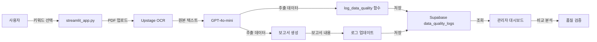

# 🎯 데이터 품질 검증 로그 시스템 구현 완료

## ✅ 구현된 기능

사용자가 원하는 **3단계 데이터 비교 시스템**이 완성되었습니다:

```
1. 선택된 추출 키워드
   ↓
2. OCR 원본 추출 데이터 (Upstage Parse)
   ↓
3. LLM 추출 데이터 (GPT-4o-mini)
   ↓
4. 보고서 생성 데이터 (최종 결과)
```

## 📁 생성된 파일

### 1. `data_quality_logs_setup.sql`
Supabase에 생성할 테이블 정의:
- `data_quality_logs` 테이블 생성
- 인덱스 및 RLS 정책 설정

### 2. `streamlit_app.py` (수정됨)
다음 기능이 추가되었습니다:

#### 추가된 함수:
- **`log_data_quality()`**: 데이터 품질 로그 기록 함수
  - OCR 원본, LLM 추출, 보고서를 한 번에 저장
  - 추출 성공률 자동 계산
  - 메타데이터 (처리 시간, 모델명 등) 포함

#### 수정된 부분:
1. **데이터 추출 시** (tab2):
   ```python
   # 추출 완료 후 자동 로깅
   log_data_quality(
       selected_keywords=field_names,
       ocr_raw_text=pdf_text,
       ocr_structured_data=structured_data,
       llm_extracted_data=extracted_data,
       llm_extraction_time_ms=extract_time,
       company_name=company_name_temp,
       pdf_filename=uploaded_file.name,
       pdf_pages=num_pages
   )
   ```

2. **보고서 생성 시** (tab3):
   ```python
   # 기존 로그 업데이트
   supabase_client.table("data_quality_logs").update({
       "report_generated": True,
       "report_content": report[:20000],
       "report_model": "gpt-4o-mini",
       "report_generation_time_ms": report_time
   }).eq("id", latest_log['id']).execute()
   ```

3. **관리자 탭** (tab_admin):
   - 새로운 탭 추가: **"🔍 데이터 품질 비교"**
   - 4단계 비교 뷰어:
     - ① 선택된 키워드 (태그 형식)
     - ② OCR 원본 데이터 (표 + 텍스트)
     - ③ LLM 추출 데이터 (성공/실패 구분)
     - ④ 보고서 생성 결과 (최종 마크다운)

### 3. `DATA_QUALITY_GUIDE.md`
사용자를 위한 상세 가이드 문서

## 🚀 설치 및 사용 방법

### 1단계: Supabase 테이블 생성

```bash
# Supabase Dashboard 접속
https://supabase.com/dashboard

# SQL Editor → New Query
# data_quality_logs_setup.sql 내용 붙여넣기
# Run 버튼 클릭
```

### 2단계: 앱 실행

```bash
streamlit run streamlit_app.py
```

### 3단계: 데이터 추출

1. 사용자 로그인
2. 키워드 선택 (예: 매출액, 영업이익, 회사명)
3. PDF 업로드
4. "데이터 추출 시작" 클릭
   → **자동으로 품질 로그 기록됨** ✅

### 4단계: 보고서 생성 (선택)

1. "보고서 생성" 탭
2. "보고서 미리보기" 클릭
   → **기존 로그에 보고서 데이터 추가됨** ✅

### 5단계: 품질 비교 분석

1. 관리자 로그인 (신봉규 계정 또는 비밀번호 입력)
2. "🔧 관리자" 탭 → "🔍 데이터 품질 비교"
3. 로그 선택
4. 4개 탭에서 단계별 비교:
   - 키워드 → OCR 원본 → LLM 추출 → 보고서

## 🎨 화면 예시

### 관리자 대시보드 - 데이터 품질 비교

```
┌───────────────────────────────────────────────────────────┐
│ 📋 상세 비교 분석                                          │
├───────────┬───────────┬───────────────┬──────────────────┤
│  회사명   │ 키워드 수 │  추출 성공률  │     표 인식      │
│ 삼성전자  │    15     │    86.7%      │      3개         │
└───────────┴───────────┴───────────────┴──────────────────┘

┌─────────────────────────────────────────────────────────────┐
│ 1️⃣ 선택된 키워드  2️⃣ OCR 원본  3️⃣ LLM 추출  4️⃣ 보고서 │
├─────────────────────────────────────────────────────────────┤
│                                                             │
│ ✅ 성공적으로 추출된 데이터                                 │
│                                                             │
│ 매출액                                                      │
│ ┌─────────────────────────────────────────────────────┐   │
│ │ 2024년 2,345억 원, 2025년 1,018억 원                │   │
│ └─────────────────────────────────────────────────────┘   │
│                                                             │
│ 영업이익                                                    │
│ ┌─────────────────────────────────────────────────────┐   │
│ │ 2024년 551억 원                                     │   │
│ └─────────────────────────────────────────────────────┘   │
│                                                             │
│ ❌ 추출 실패 데이터                                         │
│ ┌─────────────────────────────────────────────────────┐   │
│ │ 주요 리스크: 정보 없음                              │   │
│ └─────────────────────────────────────────────────────┘   │
└─────────────────────────────────────────────────────────────┘
```

## 📊 데이터 흐름



## 🔍 실제 사용 시나리오

### 시나리오 1: OCR 문제 발견

**상황**: "매출액"을 요청했는데 "정보 없음"이 나옴

**분석**:
1. 관리자 → 데이터 품질 비교 → 해당 로그 선택
2. "② OCR 원본 데이터" 탭 확인
   - 표가 제대로 인식되었는가?
   - "매출액"이라는 텍스트가 원본에 있는가?
3. **결론**: 
   - 표가 없으면 → OCR 모드를 "표 구조 인식 모드"로 변경
   - 텍스트가 깨졌으면 → PDF 품질 문제

### 시나리오 2: LLM 추론 오류 발견

**상황**: "영업이익률"을 요청했는데 "영업이익" 값이 나옴

**분석**:
1. "② OCR 원본 데이터": "영업이익률: 23.5%"
2. "③ LLM 추출 데이터": "23억 원"
3. **결론**: LLM이 "영업이익"과 "영업이익률"을 혼동
   - → 프롬프트에 더 명확한 구분 지침 추가

### 시나리오 3: 보고서 환각 발견

**상황**: 보고서에 실제 데이터에 없는 내용이 들어감

**분석**:
1. "③ LLM 추출 데이터": 실제 추출된 값 확인
2. "④ 보고서 생성 결과": 보고서에 작성된 내용 확인
3. **비교**: 추출 데이터에 없는 내용이 보고서에 있으면 환각(hallucination)
   - → 프롬프트에 "추출된 데이터만 사용" 제약 추가

## 🎯 핵심 장점

### 1. 전체 파이프라인 가시화
- OCR → LLM → 보고서 전 과정을 한눈에 비교
- 어느 단계에서 문제가 발생했는지 명확히 파악

### 2. 자동 품질 메트릭
- 추출 성공률 자동 계산
- 성공/실패 데이터 시각적 구분 (초록/빨강)

### 3. 실시간 로깅
- 사용자가 데이터 추출할 때마다 자동 기록
- 별도의 작업 불필요

### 4. 시각적 비교
- 4개 탭으로 단계별 비교
- 컬러 코딩으로 직관적 이해

## 💾 저장되는 데이터 예시

```json
{
  "session_id": "uuid-1234",
  "user_name": "신봉규",
  "company_name": "삼성전자",
  "selected_keywords": ["매출액", "영업이익", "회사명"],
  "ocr_raw_text": "삼성전자 사업보고서...",
  "ocr_structured_data": {
    "tables": [
      {"page": 1, "content": "매출액 | 2024 | 2,345억 원\n..."}
    ],
    "headings": [...]
  },
  "llm_extracted_data": {
    "매출액": "2024년 2,345억 원, 2025년 1,018억 원",
    "영업이익": "2024년 551억 원",
    "회사명": "삼성전자"
  },
  "report_generated": true,
  "report_content": "# 삼성전자 분석 보고서\n\n## 재무 현황...",
  "extraction_success_rate": 100,
  "keywords_with_data": 3,
  "keywords_missing_data": 0
}
```

## 🔧 환경 변수

`.env` 파일에 다음 변수 필요:

```env
SUPABASE_URL=your_supabase_url
SUPABASE_KEY=your_supabase_key
OPENAI_API_KEY=your_openai_key
UPSTAGE_API_KEY=your_upstage_key
ADMIN_PASSWORD=admin123
```

## 📝 다음 단계 (선택)

1. **CSV 다운로드 기능 추가**
   - 품질 로그를 CSV로 다운로드
   - Excel에서 분석 가능

2. **시계열 분석**
   - 시간에 따른 추출 성공률 변화 그래프
   - 모델별 성능 비교

3. **자동 알림**
   - 추출 성공률이 80% 미만이면 알림
   - 특정 키워드가 계속 실패하면 경고

4. **A/B 테스트**
   - 다른 프롬프트 버전 비교
   - 다른 LLM 모델 비교

---

## ✅ 체크리스트

- [x] `data_quality_logs` 테이블 생성 SQL 작성
- [x] `log_data_quality()` 함수 구현
- [x] 데이터 추출 시 자동 로깅
- [x] 보고서 생성 시 로그 업데이트
- [x] 관리자 대시보드에 비교 뷰어 추가
- [x] 4단계 탭 UI 구현
- [x] 성공/실패 데이터 시각적 구분
- [x] 사용자 가이드 문서 작성

**모든 기능이 완성되었습니다!** 🎉

이제 Supabase에서 SQL을 실행하고 앱을 사용하면 됩니다.
